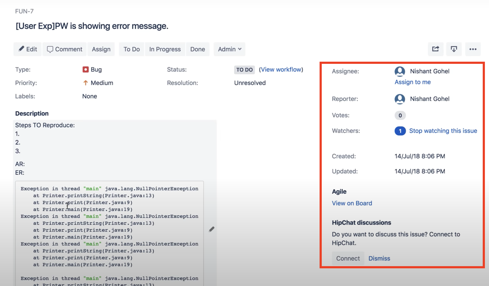

# SimpleJira [October 2020]

Chrome extension to remove the right side content on the view of single Jira ticket.

## Configuration
Make sure you provided specify values in `content_scripts.matches` fields in `manifest.json`. The default value will match with any website - it will be best if you will provide URL to your own Jira.

## How to load this extension?
Follow this step:
https://thoughtbot.com/blog/how-to-make-a-chrome-extension#load-your-extension-into-chrome

When you will open a new window with matched URL, you will be able to see in the bottom right side below button:

the button after being clicked will change the text:

and the right side component of the Jira ticket will contain 0% width - the rest components will take that space. 

You can always display once again right side component by clicking the button.

## Links
Guides which I used to create this extension: 
https://dev.to/ganeshjaiwal/build-your-first-chrome-extension-458g
https://thoughtbot.com/blog/how-to-make-a-chrome-extension#load-your-extension-into-chrome